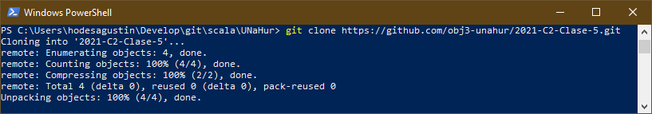
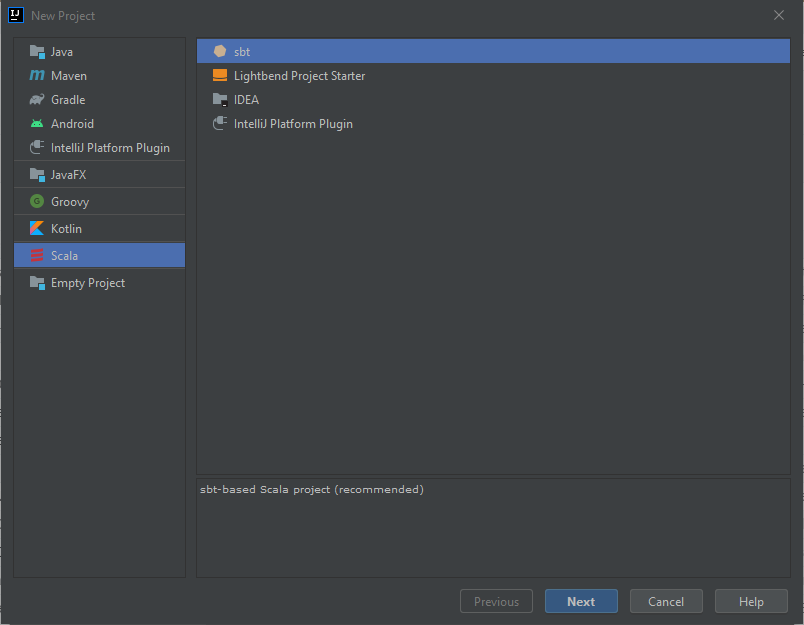
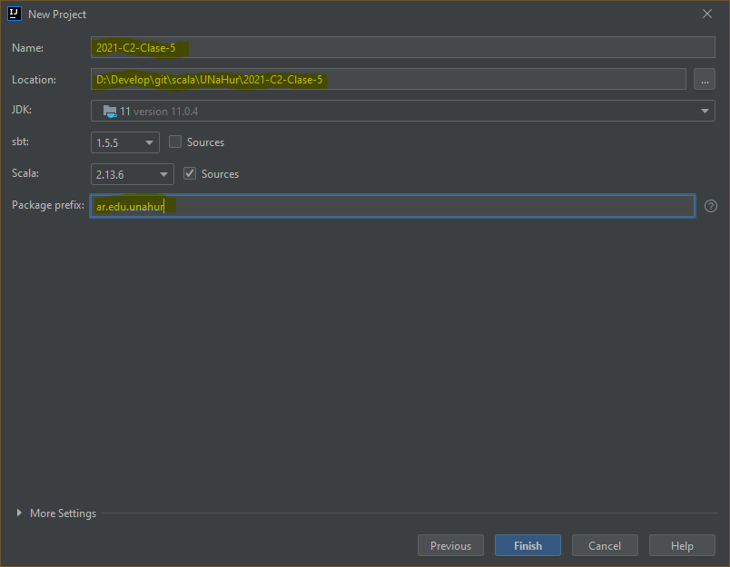
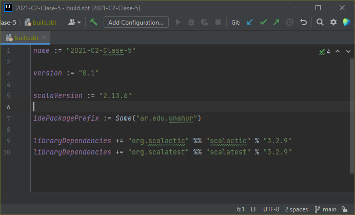

# How To Create Project

## LEER (Este tutorial está referido a la Clase 5)

Estoy teniendo problemas cuando subo al GitHub el archivo build.sbt y quiero crear un nuevo proyecto de Scala a partir de ese archivo.

Por eso les paso estos pasos que me sirvieron para importar los proyectos:

1. Clonar el repositorio de GitHub.

2. Crear un nuevo proyecto de Scala -> sbt.

3. Configurar el nuevo proyecto con los siguientes valores:
* Nombre del proyecto debe ser el mismo que el nombre de la carpeta donde se clonó el repositorio.
* Ubicación del proyecto debe ser la carpeta que se clonó.
* Prefijo del paquete debe ser: **ar.edu.unahur**

4. Configurar el archivo build.sbt agregando las 2 librerías necesarias para realizar los tests:
* libraryDependencies += "org.scalactic" %% "scalactic" % "3.2.9"
* libraryDependencies += "org.scalatest" %% "scalatest" % "3.2.9"

