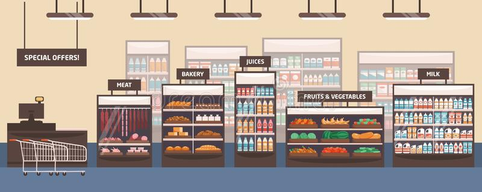

# Tienda - Scala

El objetivo del trabajo práctico es construir un programa en Scala que permita cumplir los siguientes requisitos planteados por una nueva tienda que busca informatizar su forma de manejar stock y registrar sus ventas. 

En esta entrega tenemos objetivo desarrollar la lógica necesaria para implementar la funcionalidad que se describe a continuación. Además de cumplir con los objetivos descritos, es necesario hacer el mejor uso posible de las herramientas vistas en clase, sin descuidar el diseño.
Esto incluye:
- Evitar repetir lógica.
- Evitar generar construcciones innecesarias (mantenerlo lo más simple posible).
- Buscar un diseño robusto que pueda adaptarse a nuevos requerimientos.
- Mantener las interfaces lo más limpias posibles.
- Elegir adecuadamente dónde poner la lógica y qué abstracciones modelar.
- Realizar testeos integrales de la aplicación cuidando también el diseño de los mismos.

## Antes de empezar: algunos consejos

El enunciado tiene **mucha** información, van a necesitar leerlo varias veces. La sugerencia es que lo lean entero una vez (para tener una idea general) y luego vuelvan a consultarlo las veces que hagan falta.

Concéntrense en los **requerimientos** y, excepto que se traben mucho, respeten el orden sugerido. Sería interesante que vayan creando las distintas clases y métodos a medida que resuelven cada requerimiento y no antes.

## Requerimientos

### Etapa 1 - Productos

Para poder comenzar a modelar la solución, vamos a definir los distintos tipos de Productos con los que cuenta el dominio.

- Todos los tipos de Producto contienen un **nombre** y un **precio**.
- La empresa cuenta con **productos físicos**, que contienen además sus **dimensiones** (alto, ancho y profundo).
- La empresa también cuenta con **productos digitales**, que cuentan con un **número de versión** y un valor que indica si la licencia que se otorga con dicho producto **es válida de por vida**.
- Por último, la empresa cuenta con el concepto de **Combos**. Los Combos están compuestos por **varios Productos**; y cada Combo posee un **porcentaje de descuento** sobre el precio de todos los Productos que lo componen.

Para esta etapa, se pide modelar los tres tipos de productos (físico, digital y combo). Se tiene que poder preguntarle nombre y precio a cualquiera de ellos.

### Etapa 2 - Locales, Vendedores y Ventas

A continuación tenemos los **Locales**, que cuentan con una **lista de elementos de tipo Stock** (compuesto por Producto y cantidad) y una **lista de Vendedores** que trabajan ahí. Los locales deben poder informar `montoTotal`, en donde deben retornar el precio de todo su Stock más todas las ventas realizadas por los Vendedores.

Por otro lado, tenemos a los **Vendedores**, que poseen un **nombre**, el **local** en donde trabajan, una **lista de las Ventas realizadas** y el **monto total** de comisiones acumuladas por sus ventas. Obviamente, ellos son los encargados de realizar las ventas; y para esto deben comprender el método `realizarVenta(productosPedidos: List[Producto])` (para simplicidad del método, para cada uno de los productosPedidos, se pide 1 unidad). En este método el vendedor debe crear una nueva Venta con los `productosPedidos` de los cuales tenga stock. Al terminar de agregar dichos productos se le debe sumar al vendedor la comisión, que es un 5% del monto total de la venta. Una Venta tiene que poder retornar su `montoTotal`.

Para esta etapa, se pide:
1. Poder realizar una venta. Cuando esto sucede, el vendedor que la hace la registra entre sus ventas y gana su comisión.
2. Poder consultar el monto total de un Local determinado.

### Etapa 3 - Gerente

También tenemos al **Gerente**, que lo único que le interesa es el aspecto financiero de la empresa y conoce una única forma de análisis. Es por esto que conoce 2 métodos para poder definir si se es o no rentable:

- `agregarAlAnalisis`: que recibe 1 parámetro que puede ser un Local, una Venta o un Depósito, y suma el monto total de dicho parámetro a lo que va totalizando y actualiza la cantidad de elementos analizados.
- `esRentable`: que no recibe parámetros y devuelve true si el promedio de lo que fue totalizando es mayor o igual a un valor inmutable que él cree que sirve como parámetro, este valor se determina en el momento de creación del Gerente.

### BONUS: Etapa 4 - Depósito

Además tenemos los Depósitos. Los depósitos poseen la capacidad de guardar todos los tipos de productos (con el método `guardarProducto`) pero con las siguientes condiciones:

- Si se trata de un producto físico, se debe agregar al mismo si no existiera en inventario, y si existiera, se debe sumar 1 a su cantidad.
- Si se trata de un producto digital, solamente deben guardarse las últimas versiones según el tipo de licencia.
- Si se trata de un Combo, cada uno de los productos que lo componen debe cumplir las reglas anteriores.

Los Depósitos deben poder calcular el monto total de todos los Productos que tiene guardados y deben poder ser pasados a los Gerentes para realizar su análisis.
